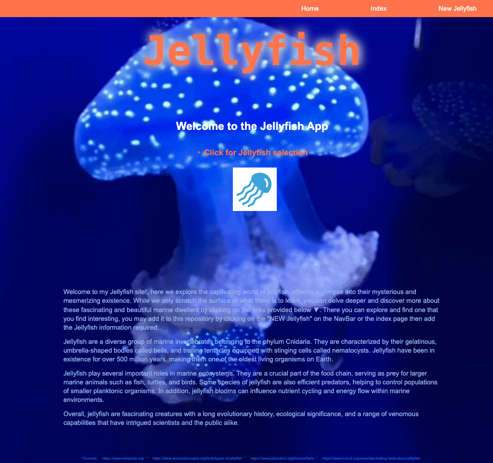

# jellyfish_2

<!DOCTYPE html>
<html>
  <head>
   <h1>👋🏻 Hello,  Welcome to the-Jellyfish-App ଳ･</h1>
<h3>Project conceptualized, coded and designed by Judy Chue</h3>
  </head>
  <body>
    <h2>Jellyfish-App</h2>
    

jellyfish-frontend is a REACT/vite app that pairs with the jellyfish-backend, which is created with "express": the Project is named:
jellyfish_2

### Jellyfish Home and Index Page:
&nbsp;&nbsp;&nbsp;&nbsp;
<!-- 
 -->
<!-- </img> -->

<h3>JellyFISH Trello Board:<h3>
<ul>
 
      <li><h4>https://trello.com/invite/b/1UpF4b90/ATTI46900af79c11c34ee4b8bcf5848bd554BD56AB17/the-jellyfish-site<h4></li>
<!--       <li>[DATABASE_URL: (https://trello.com/invite/b/1UpF4b90/ATTI46900af79c11c34ee4b8bcf5848bd554BD56AB17/the-jellyfish-site)]</li> -->
 
</img>

<h3>My jellyfish- high fidelity wireframe:<h3> 
</img>
<!-- jellyfish_HF_wireframe.png -->
<h2> Github repository link: jellyfish </h2>
<h4>Link to front and back end repo</h4>
<ul> <li>https://github.com/judychuepursuit/jellyfish_2</li>
 
<h2> This App applies the C-R-U-D points.</h2>

HTTP Methods: HTTP methods are also called verbs. They are types of requests you can make to a server. The four most common ones are listed below:

<ul>
      <li>GET /transactions: Returns a list of all transactions.</li>
      <li>POST /transactions: Creates a new transaction.</li>
      <li>PUT /transactions/: id: Updates the transaction with the specified ID.</li>
      <li>DELETE /transactions/: id: Deletes the transaction with the specified ID.</li>
</ul>
<h2>jellyfish_2: Frontend</h2>

  The REACT/vite app has the following installs/dependencies: axios, react, react-dom, react-router-dom in order to connect to the back end and the request(s) be viewed on the local host or deployed site.
 
<h2>jellyfish_2: Backend</h2>
  The EXPRESS app (use git init -y) uses the following installs and dependencies: express, nodemon, dotenv, cors also add a ‘VALIDATIONS” folder (checks apps) . 
  This App requires a db folder that has a dbconfig.js, schema.sql (contains the table “INFORMATION”) and a seed.sql file (contains   
the files Tables & “VALUES”).
  Include a .env file and type in the PORT=30xx (edit the last digits accordingly). 
  Note: Make sure that the .env file has been correctly saved inside the main folder.  
<h2>contact info:</h2>
<ul>
    <li>💻  chue.judy@gmail.com</li>
    <li>💟  https://www.linkedin.com/in/judy-chue-53697015/</li>
    <li>💡  https://judychuepursuit.github.io/my-bio-judy-chue/</li>
</ul>

<h2>Open to collaboration or work opportunities.</h2>

I am an experienced designer, applying my visual skills to coding and my goal is to be a Full-Stack web developer, that paints with code. I am excited and open to collaborating on work projects. Feel free to reach out to me if you have a project or role in mind. You can also reach out and open an issue or submit a pull request. To this repository.

